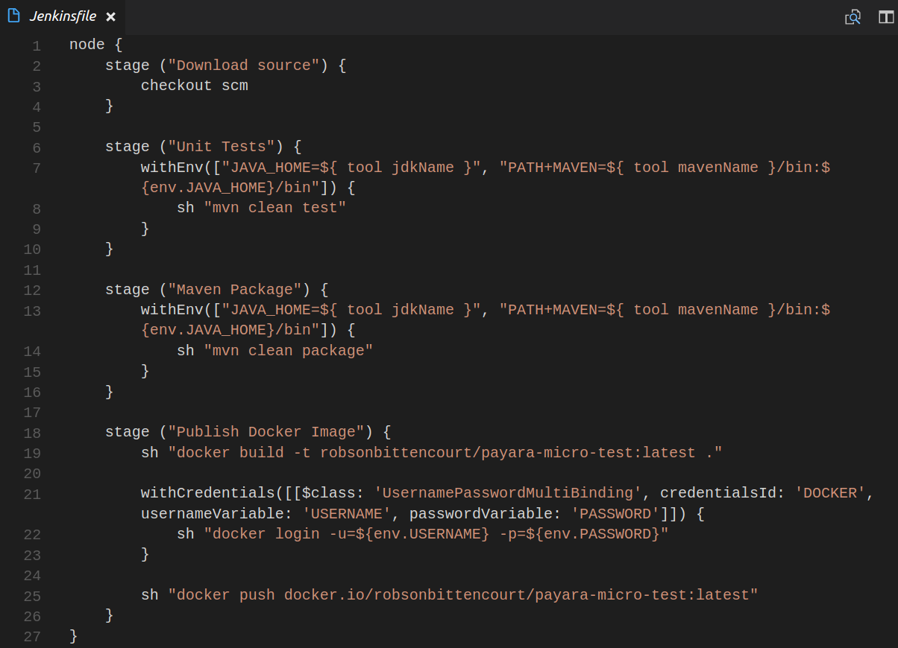
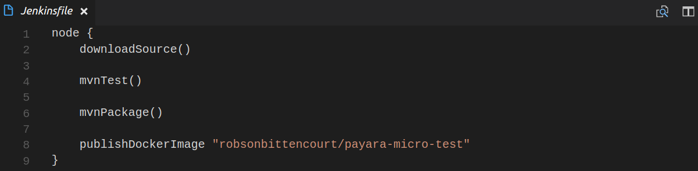
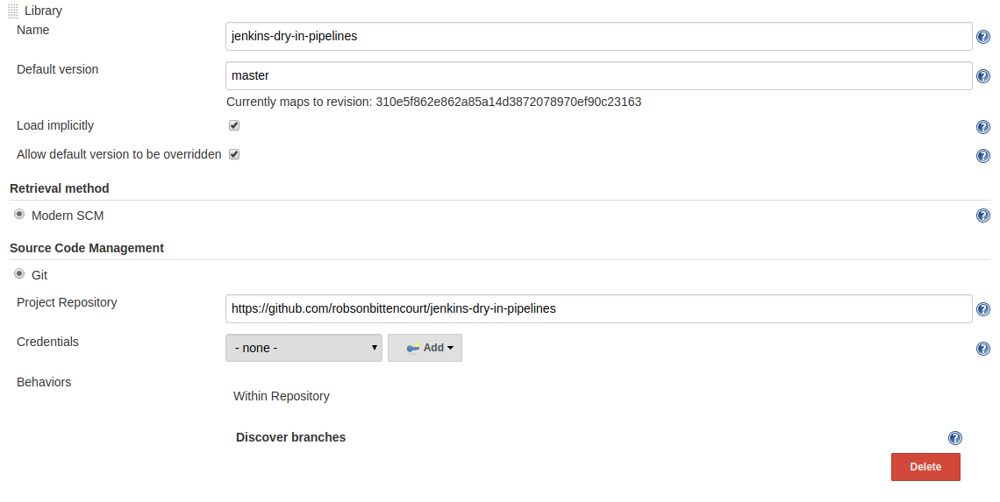

## Documentantion
The documentation with available functions can be [found here](doc.html).

## Goal
The goal of this project is to provide useful generic functions to use with [Shared Libraries](https://jenkins.io/doc/book/pipeline/shared-libraries/) feature of Jenkins Pipelines. These functions are often common to many pipelines causing code replication. With this grouping of functions it is possible to eliminate duplications by making pipeline files simpler and leaner. See the example below. (Both produce the same result)

**Normal Jenkinsfile**


**Jenkinsfile using this project**


## How to use
It is necessary to import as functions of this project into your Jenkins. To do this, go to *Manage Jenkins » Configure System » Global Pipeline Libraries* and fill the following information.



In the default version option choose the version you want to use. This project has tags following [SEMVER](http://semver.org/), you can use them to get specific versions. To always use the latest version, complete with master and the master branch will be used.

If you prefer it's not necessary check *Load implicitly* option. If you don't use this option it will be necessary import manually this script using the following instruction in top of the Jenkinsfile.

```
@Library('jenkins-dry-in-pipelines') _
```

If you want to use a version other than the configured version you can tell this in import.

```
@Library('jenkins-dry-in-pipelines@1.0.0') _
```

More details can be found [here](https://jenkins.io/doc/book/pipeline/shared-libraries/#using-libraries).

The examples in the documentation assume that the option has been checked, so the imports are not displayed